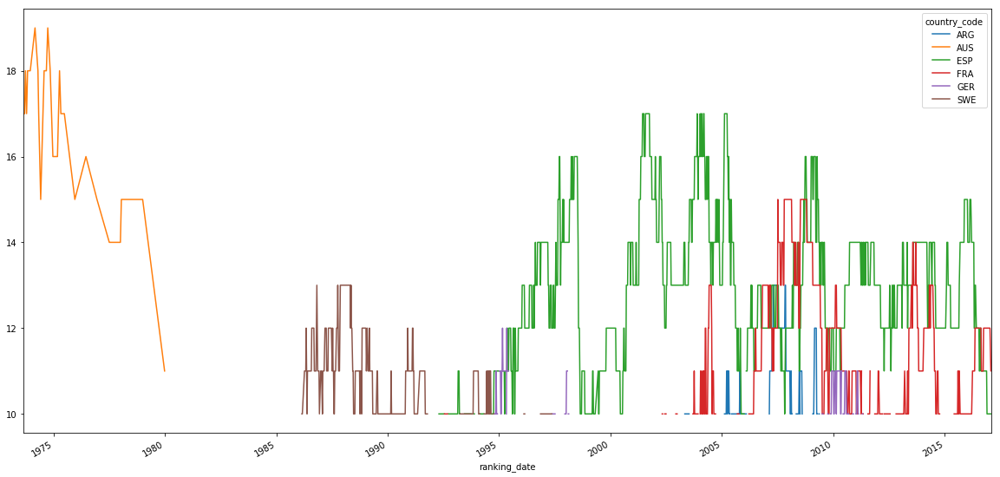

After a period of dominance in the 80s, American players are struggling to get in top 100. Now Spain and France rule the sport. 

Show the code


import pandas as pd
import glob
import matplotlib.pyplot as plt
import datetime, sys
import numpy as np

%matplotlib inline



def parse(t):
    string_ = str(t)
    try:
        return datetime.date(int(string_[:4]), int(string_[4:6]), int(string_[6:]))
    except:
        return datetime.date(1900,1,1)



def readAllFiles():
    allFiles = glob.iglob("data/atp_rankings_" + "*.csv")
    ranks = pd.DataFrame()
    list_ = list()
    for filen in allFiles:
        df = pd.read_csv(filen,
                         index_col=None,
                         header=None,
                         parse_dates=[0],
                         date_parser=lambda t:parse(t),
                         names = ["ranking_date", "ranking", "player_id", "ranking_points"])
        list_.append(df)
    ranks = pd.concat(list_)
    return ranks



def readPlayers():
    return pd.read_csv("data/atp_players.csv",
                       index_col=None,
                       header=None,
                       parse_dates=[4],
                       names = ["player_id", "first_name", "last_name", "hand", "birth_date", "country_code"],
                       date_parser=lambda t:parse(t))



# merge rankings with players but keep only top 100

ranks = readAllFiles()
ranks = ranks[(ranks['ranking']<100)]
ranks['player_id'] = ranks['player_id'].apply(lambda row: int(row))
players = readPlayers()
players = ranks.merge(players,right_on="player_id",left_on="player_id")
players.head()


<table border="1" class="dataframe">
  <thead>
    <tr style="text-align: right;">
      <th></th>
      <th>ranking_date</th>
      <th>ranking</th>
      <th>player_id</th>
      <th>ranking_points</th>
      <th>first_name</th>
      <th>last_name</th>
      <th>hand</th>
      <th>birth_date</th>
      <th>country_code</th>
    </tr>
  </thead>
  <tbody>
    <tr>
      <th>0</th>
      <td>2000-01-10</td>
      <td>1</td>
      <td>101736</td>
      <td>4135</td>
      <td>Andre</td>
      <td>Agassi</td>
      <td>R</td>
      <td>1970-04-29</td>
      <td>USA</td>
    </tr>
    <tr>
      <th>1</th>
      <td>2000-01-17</td>
      <td>1</td>
      <td>101736</td>
      <td>4135</td>
      <td>Andre</td>
      <td>Agassi</td>
      <td>R</td>
      <td>1970-04-29</td>
      <td>USA</td>
    </tr>
    <tr>
      <th>2</th>
      <td>2000-01-31</td>
      <td>1</td>
      <td>101736</td>
      <td>5045</td>
      <td>Andre</td>
      <td>Agassi</td>
      <td>R</td>
      <td>1970-04-29</td>
      <td>USA</td>
    </tr>
    <tr>
      <th>3</th>
      <td>2000-02-07</td>
      <td>1</td>
      <td>101736</td>
      <td>5045</td>
      <td>Andre</td>
      <td>Agassi</td>
      <td>R</td>
      <td>1970-04-29</td>
      <td>USA</td>
    </tr>
    <tr>
      <th>4</th>
      <td>2000-02-14</td>
      <td>1</td>
      <td>101736</td>
      <td>5045</td>
      <td>Andre</td>
      <td>Agassi</td>
      <td>R</td>
      <td>1970-04-29</td>
      <td>USA</td>
    </tr>
  </tbody>
</table>


# we are interested in ranking date, country code and counting the number of players. 
# To keep the data cleaner get only countries with at least 4 players in top 100

aggregate = players[["ranking_date", "country_code"]].groupby(["ranking_date","country_code"]).size().to_frame()
aggregate = pd.DataFrame(aggregate.to_records()) # transform the series to df
aggregate_least_4 = aggregate[(aggregate["0"] > 3)]
aggregate_least_10 = aggregate[(aggregate["0"] > 9)]



# countries with at least 10 players in top 10 at a given time.
# we can see that the US has dominated until 1997, when Spain started to take the lead.
# Since 2000, Spain and France had the most players in top 100. 

pivoted = pd.pivot_table(aggregate_least_10, values='0', columns='country_code', index="ranking_date")
pivoted.plot(figsize=(20,10))


Without the outlier USA we get a better image.

Show the code


# Let's see that figure again without the outlier USA

aggregate_no_usa = aggregate[(aggregate["country_code"] != "USA") & (aggregate["0"] > 9)]
pivoted = pd.pivot_table(aggregate_no_usa, values='0', columns='country_code', index="ranking_date")
pivoted.plot(figsize=(20,10))


Le'ts see after 2000 a close-up of France and Spain's dominance:

Show the code


# after 2000 Spain and France dominate with an average of 15 players in top 100

aggregate_after_2000 = aggregate[(aggregate["ranking_date"] > "2000-01-01" ) & (aggregate["0"] > 9)]
pivoted = pd.pivot_table(aggregate_after_2000, values='0', columns='country_code', index="ranking_date")
pivoted.plot(figsize=(20,10))


By continent we see that North America dominated in the 80, while Europe has increased it's dominance since early 90s. Now North America is surpassed by South America and on par with Asia.

Show the code


# let's see how it fairs by continent

import json

with open('iso3.json') as data_file:    
    countries = json.load(data_file)
with open('continent.json') as data_file:    
    continents = json.load(data_file)



ioc_countries = {}
for country in countries:
    if country["ioc"]:
        ioc_countries[country["ioc"]] = country["alpha2"]
ioc_countries["YUG"] = "MK"
aggregate_continents = aggregate.copy()
ioc_countries
aggregate_continents
aggregate_continents["country_code"] = aggregate_continents["country_code"].apply(lambda row: continents[ioc_countries[row]])

aggregate_continents = aggregate_continents[["ranking_date", "country_code", "0"]].groupby(["ranking_date", "country_code"]).sum()
aggregate_continents = pd.DataFrame(aggregate_continents.to_records()) # transform the series to df
pivoted = pd.pivot_table(aggregate_continents, values='0', columns='country_code', index="ranking_date")
pivoted.plot(figsize=(20,10))


