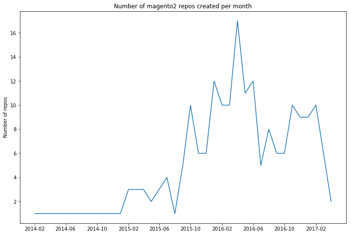
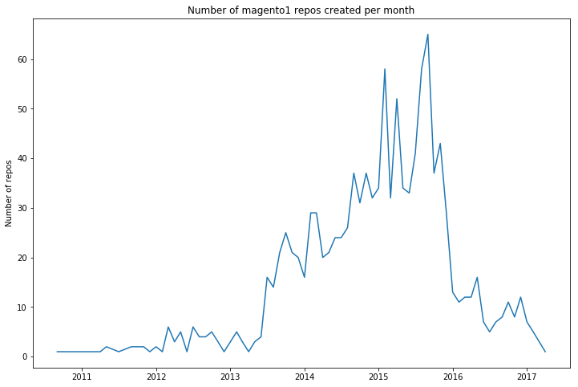
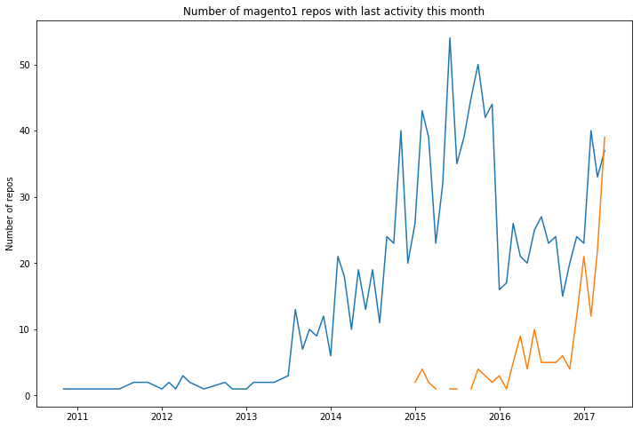
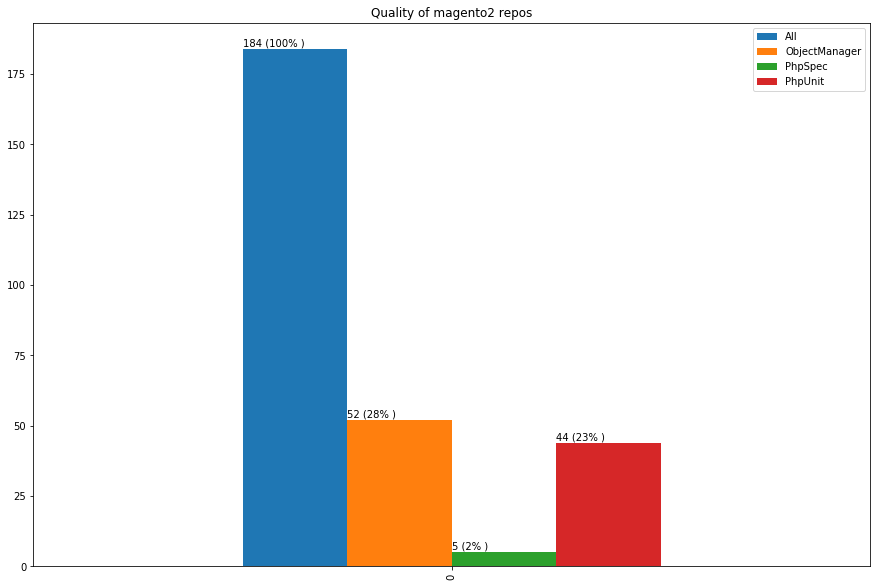

Show the code


import pandas as pd
import matplotlib.pyplot as plt
import numpy as np
import datetime

%matplotlib inline



def dateparse(timestamp: int) -> str:
    date = datetime.datetime.fromtimestamp(float(timestamp))
    return "%d-%d" % (date.year, date.month)



# load the data

magento2_data = pd.read_csv(
    'data/magento-github/m2-data-dates.csv',
    sep=',',
    header=None,
    names = ["Repo", "Start Date", "Last Commit"],
    dtype = {
        "Repo": "str"
    },
    parse_dates=["Start Date","Last Commit"],
    date_parser=dateparse
)

magento1_data = pd.read_csv(
    'data/magento-github/m1-data-dates.csv',
    sep=',',
    header=None,
    names = ["Repo", "Start Date", "Last Commit"],
    dtype = {
        "Repo": "str"
    },
    parse_dates=["Start Date","Last Commit"],
    date_parser=dateparse
)



magento2_data_start_dates = magento2_data.copy()
magento2_data_start_dates.drop(["Last Commit", "Repo"], axis = 1, inplace = True)
magento2_data_start_dates = magento2_data_start_dates.groupby("Start Date").size().to_frame('Total')



# We can see that the number of repos created was the highest in the middle of 2016

f, ax = plt.subplots(figsize=(12, 8))
ax.plot(magento2_data_start_dates)
ax.set(title='Number of magento2 repos created per month', ylabel='Number of repos')


Show the code


# let's see for magento1
# although decreasing hard since begining of 2016, there are still magento1 repos being created

magento1_data_start_dates = magento1_data.copy()
magento1_data_start_dates.drop(["Last Commit", "Repo"], axis = 1, inplace = True)
magento1_data_start_dates = magento1_data_start_dates.groupby("Start Date").size().to_frame('Total')
f, ax = plt.subplots(figsize=(12, 8))
ax.plot(magento1_data_start_dates)
ax.set(title='Number of magento1 repos created per month', ylabel='Number of repos')


Show the code


# plotting the 2 of them together we see that magento2 is struggling to catch up with magento1
# and has a long way until it reaches magento1 highest period when there were up to 60 repos created per month

magento_start_date = pd.merge(magento1_data_start_dates, magento2_data_start_dates, how='outer', left_index=True, right_index=True)

f, ax = plt.subplots(figsize=(12, 8))
ax.plot(magento_start_date)
ax.set(title='Number of magento1 and magento2 repos created', ylabel='Number of repos')


Show the code


# but let's see how active are the magento1 repos vs magento2 repos

magento1_data_last_commit = magento1_data.copy()
magento1_data_last_commit.drop(["Start Date", "Repo"], axis = 1, inplace = True)
magento1_data_last_commit = magento1_data_last_commit.groupby("Last Commit").size().to_frame('Total1')

magento2_data_last_commit = magento2_data.copy()
magento2_data_last_commit.drop(["Start Date", "Repo"], axis = 1, inplace = True)
magento2_data_last_commit = magento2_data_last_commit.groupby("Last Commit").size().to_frame('Total2')

magento_last_commit = pd.merge(magento1_data_last_commit, magento2_data_last_commit, how='outer', left_index=True, right_index=True)

f, ax = plt.subplots(figsize=(12, 8))
ax.plot(magento_last_commit)
ax.set(title='Number of magento1 repos with last activity this month', ylabel='Number of repos')


Show the code


from github import Github
import csv
import time

with open('data/magento-github/magento2-modules.csv', 'r') as f:
    reader = csv.reader(f)
    module_list = list(reader)

g = Github("ClaudiuCreanga", "code")

phpspec_tested_modules = []

for index,module in enumerate(module_list):
    if index % 20 == 0:
        time.sleep(5)
    repo = g.get_repo(module[0])
    if repo.get_contents("/"):
        phpspec = g.search_code("PHPUnit in:file repo:%s" % module[0])
        try:
            list(phpspec)
            if len(list(phpspec)):
                phpspec_tested_modules.append(module[0])
        except:
            pass

with open('data/magento-github/unit.csv', 'w') as myfile:
    wr = csv.writer(myfile)
    wr.writerow(phpspec_tested_modules)



obj_manager_modules = []

for index,module in enumerate(module_list):
    if index % 20 == 0:
        time.sleep(5)
    repo = g.get_repo(module[0])
    if repo.get_contents("/"):
        obj = g.search_code("\Magento\Framework\App\ObjectManager in:file language:php repo:%s" % module[0])
        try:
            list(obj)
            if len(list(obj)):
                obj_manager_modules.append(module[0])
        except:
            pass

with open('data/magento-github/object_manager.csv', 'w') as myfile:
    wr = csv.writer(myfile)
    wr.writerow(obj_manager_modules)



# code quality
def percentage(part, whole):
  return int(100 * float(part)/float(whole))

quality = pd.DataFrame.from_records([{"All":184 , "PhpSpec": 5, "PhpUnit": 44, "ObjectManager":52}])
ax = quality.plot(kind="bar", title="Quality of magento2 repos", figsize=(15,10), legend=True)
for p in ax.patches:
    ax.annotate(str(int(p.get_height())) +" ("+ str(percentage(p.get_height(), 184)) + "% )", ((p.get_x()), int(p.get_height() + 1)))


