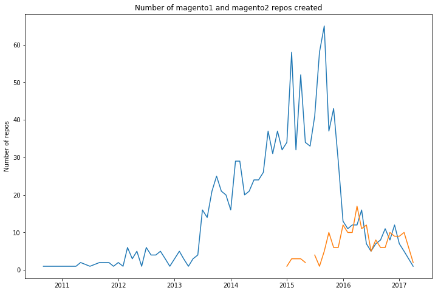

Magento2 was released almost 2 years ago and the response was mixed (to say the least). Many developers complained about the frontend workflow and the amount of bugs. But, in the end,
the update was needed and we have a new modern php ecommerce framework.

Magento Inc. has done a radical shift towards open source with magento2. But let's see if the open source community embraced the new platform.

I'm starting my analysis with Google BigQuery to find all magento2 and magento1 modules on github. 

Show the code


SELECT
  repo_name
FROM
  [bigquery-public-data:github_repos.files] files
WHERE
  files.path LIKE "%etc/module.xml"
GROUP BY
  repo_name


This query returned over 250 magento2 modules, but openning a few of them I realised that some of them were sample modules or themes or even whole client projects. So some data curation was needed. With python and selenium I'm opening 250 tabs with every github project for manual inspections.

Show the code


from selenium import webdriver
import csv

driver = webdriver.Chrome()

with open('data/magento-github/magento2-modules.csv', 'r') as f:
    reader = csv.reader(f)
    module_list = list(reader)

for item in module_list:
    url = 'window.open("https://github.com/{0}")'.format(item[0])
    driver.execute_script(url)
    


After curation we have only 184 true magento2 modules. Doing the same process for magento1 gave us 1168 modules. We can see that magento2 still has a lot of catchup to do in terms of open source modules, even after 2 years.

Show the code


all_modules = pd.DataFrame([{"magento1": 1168, "magento2": 184}])
ax = all_modules.plot(kind="bar", title="Total number of magento1 and magento2 modules", figsize=(15,10), legend=True)
for p in ax.patches:
    ax.annotate(str(int(p.get_height())) +" ("+ str(percentage(p.get_height(), 1168)) + "% )", ((p.get_x()), int(p.get_height() + 1)))


With PyGithub let's gather more data about this modules and see in terms of activity how it fares.

Show the code


import pandas as pd
import matplotlib.pyplot as plt
import numpy as np
import datetime

%matplotlib inline



def dateparse(timestamp: int) -> str:
    date = datetime.datetime.fromtimestamp(float(timestamp))
    return "%d-%d" % (date.year, date.month)



# load the data

magento2_data = pd.read_csv(
    'data/magento-github/m2-data-dates.csv',
    sep=',',
    header=None,
    names = ["Repo", "Start Date", "Last Commit"],
    dtype = {
        "Repo": "str"
    },
    parse_dates=["Start Date","Last Commit"],
    date_parser=dateparse
)

magento1_data = pd.read_csv(
    'data/magento-github/m1-data-dates.csv',
    sep=',',
    header=None,
    names = ["Repo", "Start Date", "Last Commit"],
    dtype = {
        "Repo": "str"
    },
    parse_dates=["Start Date","Last Commit"],
    date_parser=dateparse
)



magento2_data_start_dates = magento2_data.copy()
magento2_data_start_dates.drop(["Last Commit", "Repo"], axis = 1, inplace = True)
magento2_data_start_dates = magento2_data_start_dates.groupby("Start Date").size().to_frame('Total')



# We can see that the number of repos created was the highest in the middle of 2016

f, ax = plt.subplots(figsize=(12, 8))
ax.plot(magento2_data_start_dates)
ax.set(title='Number of magento2 repos created per month', ylabel='Number of repos')


 We can see that the number of magento2 repos created was the highest in the middle of 2016.

For magento1, although decreasing hard since begining of 2016, there are still new modules being created, almost on par with magento2.

Show the code


# let's see for magento1
# although decreasing hard since begining of 2016, there are still magento1 repos being created

magento1_data_start_dates = magento1_data.copy()
magento1_data_start_dates.drop(["Last Commit", "Repo"], axis = 1, inplace = True)
magento1_data_start_dates = magento1_data_start_dates.groupby("Start Date").size().to_frame('Total')
f, ax = plt.subplots(figsize=(12, 8))
ax.plot(magento1_data_start_dates)
ax.set(title='Number of magento1 repos created per month', ylabel='Number of repos')


Plotting the two of them together, we see that magento2 is struggling to catch up with magento1 and has a long way until it reaches magento1 highest period when there were up to 60 repos created per month

Show the code


# plotting the 2 of them together we see that magento2 is struggling to catch up with magento1
# and has a long way until it reaches magento1 highest period when there were up to 60 repos created per month

magento_start_date = pd.merge(magento1_data_start_dates, magento2_data_start_dates, how='outer', left_index=True, right_index=True)

f, ax = plt.subplots(figsize=(12, 8))
ax.plot(magento_start_date)
ax.set(title='Number of magento1 and magento2 repos created', ylabel='Number of repos')


Maybe the magento2 modules are more active then the magento1 modules?

Show the code


# but let's see how active are the magento1 repos vs magento2 repos

magento1_data_last_commit = magento1_data.copy()
magento1_data_last_commit.drop(["Start Date", "Repo"], axis = 1, inplace = True)
magento1_data_last_commit = magento1_data_last_commit.groupby("Last Commit").size().to_frame('Total1')

magento2_data_last_commit = magento2_data.copy()
magento2_data_last_commit.drop(["Start Date", "Repo"], axis = 1, inplace = True)
magento2_data_last_commit = magento2_data_last_commit.groupby("Last Commit").size().to_frame('Total2')

magento_last_commit = pd.merge(magento1_data_last_commit, magento2_data_last_commit, how='outer', left_index=True, right_index=True)

f, ax = plt.subplots(figsize=(12, 8))
ax.plot(magento_last_commit)
ax.set(title='Number of magento1 repos with last activity this month', ylabel='Number of repos')


As a percentage, yes, magento2 modules have the last commit date more recent.

Let's analyze the quality of magento2 repos and see how many of them are unit tested and how many of them use the object manager directly.

Show the code


from github import Github
import csv
import time

with open('data/magento-github/magento2-modules.csv', 'r') as f:
    reader = csv.reader(f)
    module_list = list(reader)

g = Github("ClaudiuCreanga", "token")

phpspec_tested_modules = []

for index,module in enumerate(module_list):
    if index % 20 == 0:
        time.sleep(5)
    repo = g.get_repo(module[0])
    if repo.get_contents("/"):
        phpspec = g.search_code("PHPUnit in:file repo:%s" % module[0])
        try:
            list(phpspec)
            if len(list(phpspec)):
                phpspec_tested_modules.append(module[0])
        except:
            pass

with open('data/magento-github/unit.csv', 'w') as myfile:
    wr = csv.writer(myfile)
    wr.writerow(phpspec_tested_modules)



obj_manager_modules = []

for index,module in enumerate(module_list):
    if index % 20 == 0:
        time.sleep(5)
    repo = g.get_repo(module[0])
    if repo.get_contents("/"):
        obj = g.search_code("\Magento\Framework\App\ObjectManager in:file language:php repo:%s" % module[0])
        try:
            list(obj)
            if len(list(obj)):
                obj_manager_modules.append(module[0])
        except:
            pass

with open('data/magento-github/object_manager.csv', 'w') as myfile:
    wr = csv.writer(myfile)
    wr.writerow(obj_manager_modules)



# code quality
def percentage(part, whole):
  return int(100 * float(part)/float(whole))

quality = pd.DataFrame.from_records([{"All":184 , "PhpSpec": 5, "PhpUnit": 44, "ObjectManager":52}])
ax = quality.plot(kind="bar", title="Quality of magento2 repos", figsize=(15,10), legend=True)
for p in ax.patches:
    ax.annotate(str(int(p.get_height())) +" ("+ str(percentage(p.get_height(), 184)) + "% )", ((p.get_x()), int(p.get_height() + 1)))


Only a quarter of the modules are unit tested and over a quarter are using the object manager directly. 

