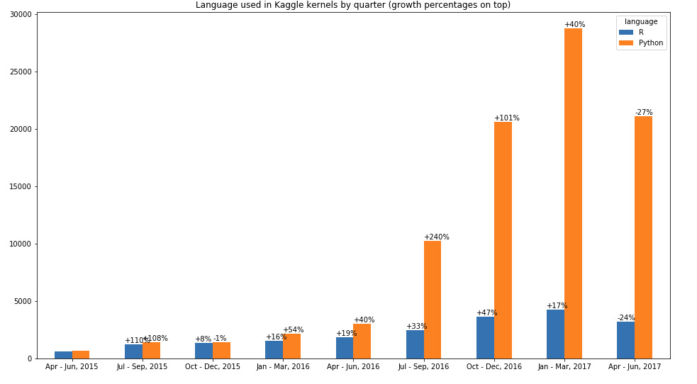
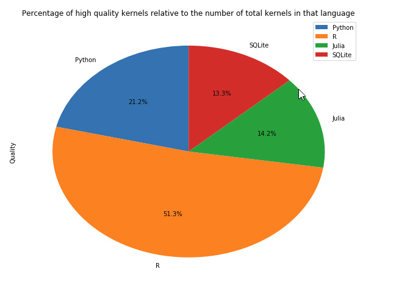

TL;DR; Python is king, but R kernels are more likely to win medals

The kernels feature on kaggle.com was introduced around March 2015 and became quickly popular among data scientists. 
In 2017 in every month almost 10.000 new kernels are created.

Kaggle does not provide an api, so to get the data about kernles we had to scrape the website, which returned 114.896 kernels

Show the code


import scrapy
import json
import logging
from w3lib.url import add_or_replace_parameter
import re
class MySpider(scrapy.Spider):
    name = 'myspider'
    start_urls = ['https://www.kaggle.com/kernels/all/20?sortBy=date&after=false']
    page = 0
    ids = []

    def parse(self, response):
        data = json.loads(str(response.body, 'utf-8'))
        for item in data:
            finalData = {
                "language": item["languageName"],
                "comments": item["totalComments"],
                "votes": item["totalVotes"],
                "medal": item["medal"],
                "id": item["id"],
                "date": item["scriptVersionDateCreated"]
            }
            id = item["id"]
            yield finalData

        if id not in self.ids:
            self.ids.append(id)
        else:
            logging.info("The id is duplicate, stop here")
            return

        if data[len(data) - 1]["id"]:
            self.page += 20
            if self.page > 1000:
                self.page = 1000
            url = add_or_replace_parameter(response.url, 'after', data[len(data) - 1]["id"])
            url = re.sub(r"([0-9]){1,9}(?=\?)", str(self.page), url)
            yield scrapy.Request(url, self.parse)


From the chart bellow we can see that R and Python were used almost equally at first but then at the beginning of 2016 Python started to
grow much more rapidly then R. The other 2 languages (Julia and SQLite) were not used often enough to be meaningful in the chart. 

Show the code


import pandas as pd
import matplotlib.pyplot as plt
import numpy as np
import datetime

%matplotlib inline

def dateparse(date) -> str:
    date = date.split("-")
    return "%s-%s" % (date[0], date[1])

kernels_data = pd.read_csv(
    r"C:\Users\scrapoulet\Downloads\kaggle-master\kaggle-master\data\kaggle\all_data.csv",
    parse_dates=["date"],
    date_parser=dateparse
)

languages = kernels_data[["date", "language"]]
languages = languages.groupby(["date","language"]).size().to_frame("Total").unstack().resample("Q").sum()
def quarterlyMonthNmaes(x): 
    start_date = x.name - pd.offsets.MonthBegin(3)
    final_date = str(start_date.strftime('%b')) + " - " + str(x.name.strftime('%b, %Y'))
    return final_date
languages_quarterly = languages.copy()
languages_quarterly.index = languages["Total"].apply(quarterlyMonthNmaes, axis=1) 

languages_python_r = languages_quarterly["Total"][["R", "Python"]]
languages_python_r.fillna(0, inplace=True)
languages_python_r.drop(languages_python_r.index[[0,10]], inplace=True)

def growth(current, previous):
    increase = current - previous
    if increase != 0.0 and previous != 0.0:
        number = round(increase / previous * 100)
        return '{0:{1}}'.format(number, '+' if number else '') 
    return 0

ax = languages_python_r.plot.bar(figsize=(16,9), rot=0,  title="Language used in Kaggle kernels by quarter (growth percentages on top)")
for index, p in enumerate(ax.patches):
    previous_height = ax.patches[index - 1].get_height()
    if index == 0 or index == 9: continue
    ax.annotate(str(growth(p.get_height(), previous_height)) + "%", ((p.get_x()), int(p.get_height() + 150)))


To see the quality of the kernels we can check how many medals did the kernels receive. We followed the Olympics rule of giving to gold
medals 3 points, to silver 2 points and to bronze 1 point.

Python kernels got almost twice as many medals than R (2241 compared to 1235), but has a 

Show the code


medals = kernels_data[["date", "language", "medal"]]
def medals_to_points(x):
    if x == "gold": 
        return 3
    if x == "bronze":
        return 1
    if x == "silver":
        return 2
    return 0
medals.fillna(0, inplace=True)
medals_transformed = medals.copy()
medals_transformed["medal"] = medals_transformed["medal"].apply(medals_to_points)

python_nr_kernals = medals_transformed.loc[medals_transformed["language"] == "Python"].count().medal
r_nr_kernels = medals_transformed.loc[medals_transformed["language"] == "R"].count().medal
julia_nr_kernels = medals_transformed.loc[medals_transformed["language"] == "Julia"].count().medal
sql_nr_kernels = medals_transformed.loc[medals_transformed["language"] == "SQLite"].count().medal

medals_transformed_points = medals_transformed.groupby(["language"]).sum()
python_points = medals_transformed_points.loc["Python"].medal
r_points = medals_transformed_points.loc["R"].medal
julia_points = medals_transformed_points.loc["Julia"].medal
sql_points = medals_transformed_points.loc["SQLite"].medal

def medals_percentage(percent, whole):
  return round((percent * 100.0) / whole, 1)

python_quality_kernels_percentage = medals_percentage(python_points, python_nr_kernals)
r_quality_kernels_percentage = medals_percentage(r_points, r_nr_kernels)
julia_quality_kernels_percentage = medals_percentage(julia_points, julia_nr_kernels)
sql_quality_kernels_percentage = medals_percentage(sql_points, sql_nr_kernels)

medals_graph = pd.DataFrame({"index": ["Nr of kernels", "Medal Points", "Percentage of quality kernels"], "R": [r_nr_kernels,r_points,r_quality_kernels_percentage], "Python": [python_nr_kernals,python_points,python_quality_kernels_percentage], "Julia": [julia_nr_kernels, julia_points, julia_quality_kernels_percentage], "SQLite": [sql_nr_kernels, sql_points, sql_quality_kernels_percentage] })      
medals_graph.set_index("index", inplace=True)

quality_kernels = pd.DataFrame({"index": ["Python", "R", "Julia", "SQLite"], "Quality": [2.4, 5.8, 1.6, 1.5]}).set_index("index")
quality_kernels.plot.pie(figsize=(10,8), y = "Quality", title="Percentage of high quality kernels relative to the number of total kernels in that language",autopct='%1.1f%%', 
 startangle=90, shadow=False)


R has a longer history in data science and, arguably, R users have more experience in this field while Python is easier to learn and 
likely the language of choice for beginners in data science.

