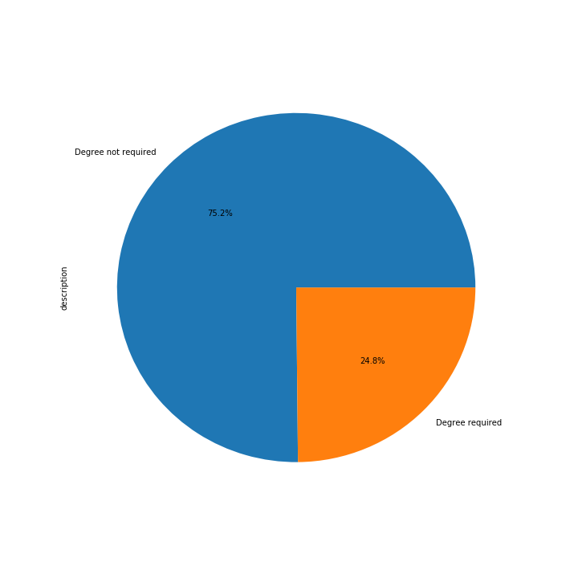

TL;DR; Python is the most required skill if you're looking for a data science job on Stackoverflow.

Searching for a data science job on stackoverflow will return at the moment 162 job openings.

Show the code


<?php

require_once(__DIR__ . '/vendor/autoload.php');
// Add parameters to the query via the constructor
$query = new JobApis\Jobs\Client\Queries\StackoverflowQuery();

// Add parameters via the set() method
$query->set('q', 'data scientist');

// Instantiating a provider with a query object
$client = new JobApis\Jobs\Client\Providers\StackoverflowProvider($query);

// Get a Collection of Jobs
$jobs = $client->getJobs();

$data = [];

foreach($jobs->all() as $key => $job) {
    $data[$key] = ["skills" => $job->getSkills(), "description" => $job->getDescription()];
}

$fp = fopen("data-science-jobs.csv", 'w');
foreach ($data as $key => $fields) {
    if ($key === 0) {
        fputcsv($fp,["skills", "description"]);
    }
    fputcsv($fp, $fields);
}

fclose($fp);

?>


If we are looking at the skills required section, we will see that the first 10 skills are:

Show the code


import pandas as pd
import matplotlib.pyplot as plt
import numpy as np
import datetime

%matplotlib inline

jobs_data = pd.read_csv(
    "data/stackoverflow/data-science-jobs.csv"
)

from collections import Counter

skills = jobs_data["skills"].dropna()
skills_list = skills.str.split(",").as_matrix().flat
single_skills_list = [item.strip(" ") for sublist in skills_list for item in sublist]

occurences = Counter(single_skills_list)
sorted_occurences = occurences.most_common()

sorted_occurences_first_10 = sorted_occurences[:10]
sorted_occurences_dict = dict((x, y) for x, y in sorted_occurences_first_10)
explode = (0.1, 0, 0, 0, 0, 0, 0, 0, 0, 0)
fig = plt.figure(figsize=(10,10))
plt.pie([float(v) for v in sorted_occurences_dict.values()], labels=[k for k in sorted_occurences_dict],
            autopct='%1.1f%%', explode=explode, shadow=True, startangle=140)



Contrary to my expectation, the degree is mentioned in only a quarter of the job posts:

Show the code


description = jobs_data["description"].dropna()
description_degree = description.str.lower().str.contains('degree').value_counts()

fig = plt.figure(figsize=(10,10))
description_degree.plot(kind="pie", labels=["Degree not required","Degree required"], autopct='%1.1f%%')



Full code <a href="https://github.com/ClaudiuCreanga/kaggle/blob/master/stackoverflow-data-science-tools.ipynb" target="_blank">here</a>.

