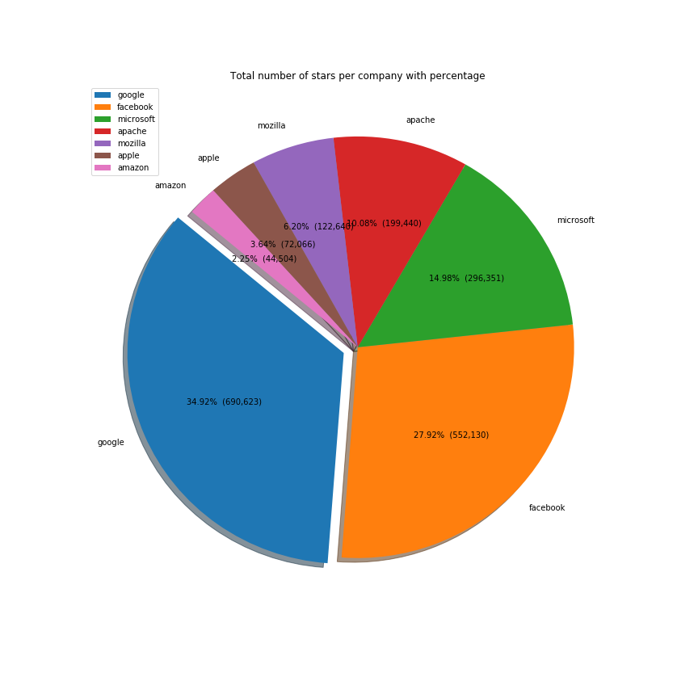
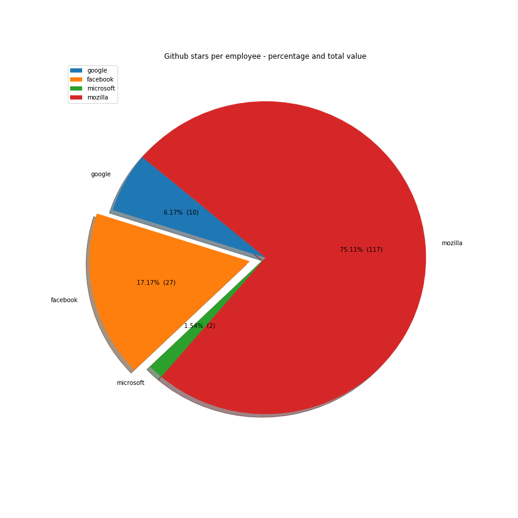
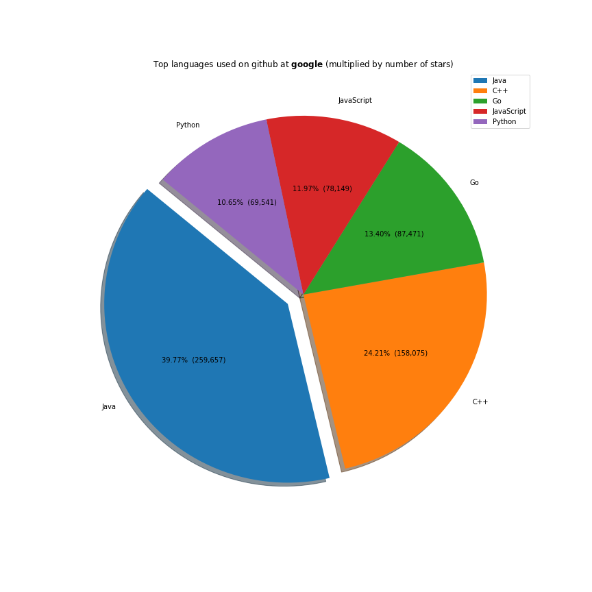
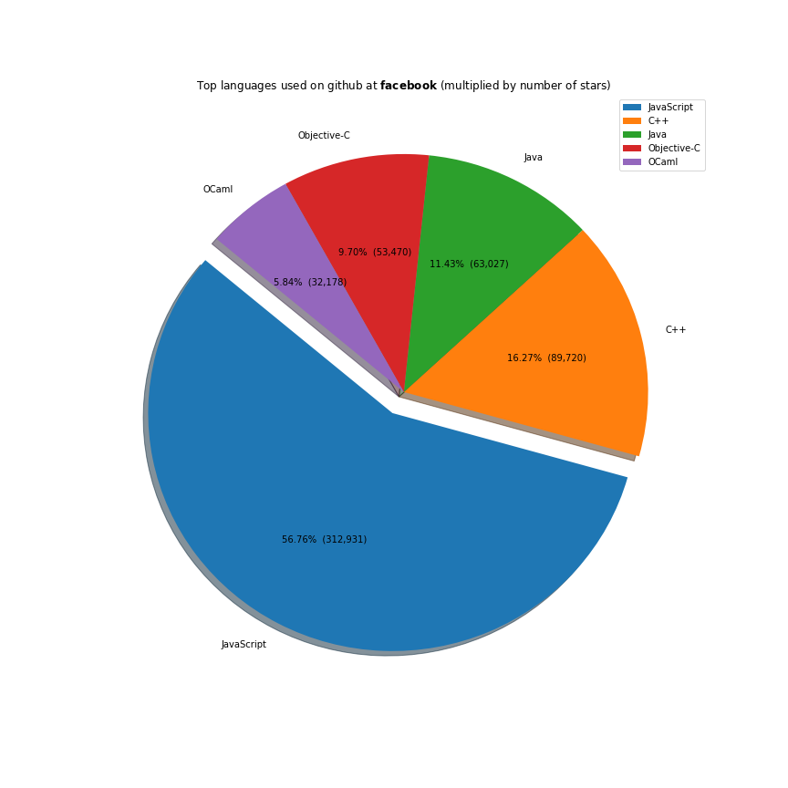
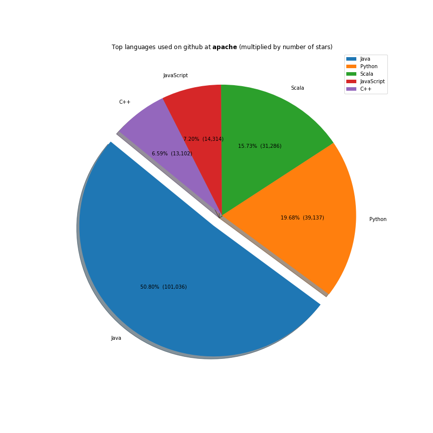
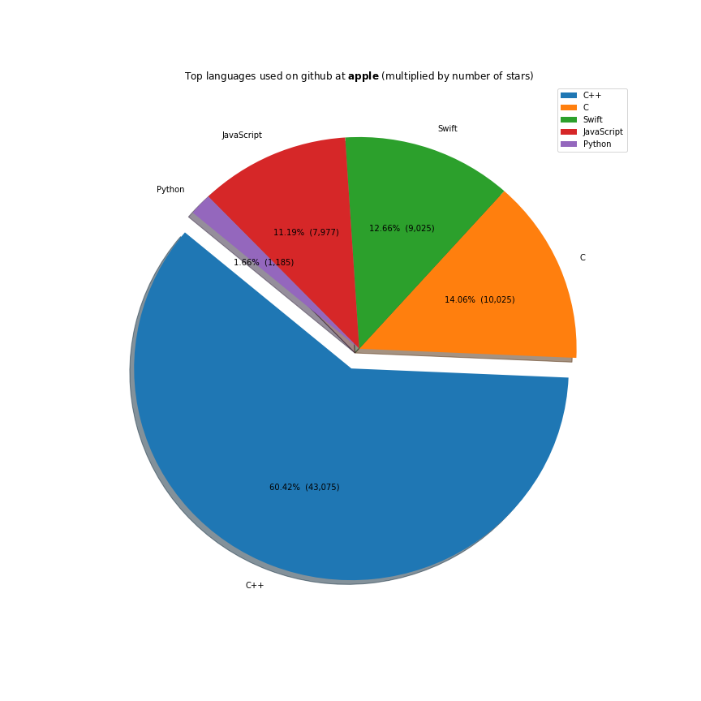
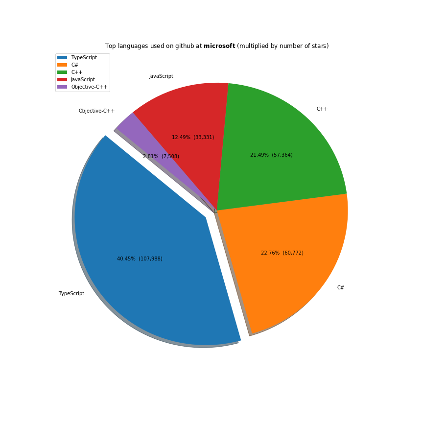
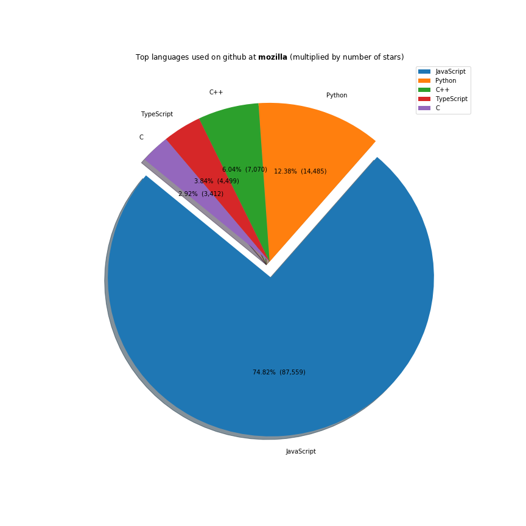
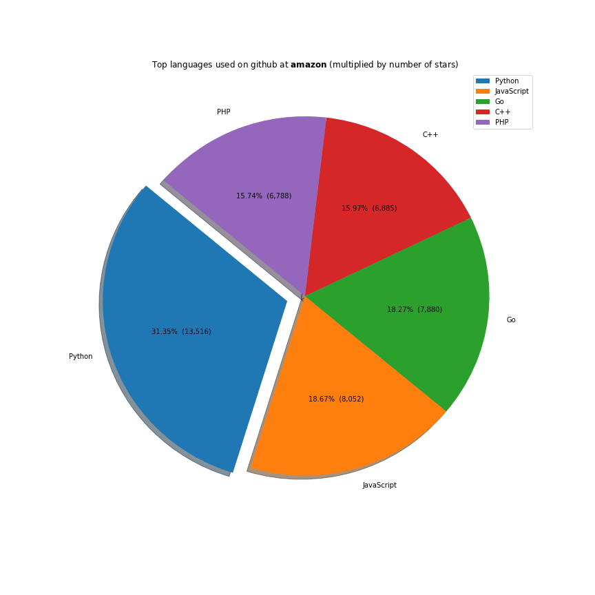

TL;DR; Google is the most influential company on Github, but judging by the number of employees, Facebook fares better. As expected, javascript is the most used language.

Show the code



#get the data

import requests
import csv

data = []
head = {'Authorization': 'token code'}

def saveData(body, company):
    for item in body["items"]:
        data.append([company, item["full_name"], item["stargazers_count"], item["watchers_count"], item["language"]])

def getNextUrl(headers):
    links = headers.get('link', None)
    if links is not None:
        individualLinks = links.split(",")
        firstLink = individualLinks[0].split(";")
        if "next" in firstLink[1]:
            nextPageUrl = firstLink[0][1:-1]
            return nextPageUrl
        else:
            return None
    return None

def getData(url):
    response = requests.get(url, headers=head)
    return response

def queryApi(url, company):
    content = getData(url)
    saveData(content.json(), company)
    nextUrl = getNextUrl(content.headers)
    if nextUrl:
        return queryApi(nextUrl, company)
    else:
        return None

company_lists = {
    "google" : ["google", "googlesamples"],
    "facebook" : ["facebook"],
    "apache" : ["apache"],
    "microsoft" : ["microsoft"],
    "mozilla" : ["mozilla"],
    "apple": ["apple"],
    "amazon": ["amzn", "amazonwebservices", "aws"]
}

for key, value in company_lists.items():
    for company in value:
        queryApi("https://api.github.com/search/repositories?q=org:{}&type=Repositories&per_page=100".format(company), key)

with open('../data/github-companies/companies2.csv', 'w') as myfile:
    wr = csv.writer(myfile)
    wr.writerow(['Company', 'Repository', 'Stars', 'Watchers', 'Language'])
    for x in data:
        wr.writerow(x)



To calculate the most influential companies we calculate the number of repositories multiplied by the number of stars received.

Google is the most influential company on Github, followed up by Facebook, Microsoft, Apache and Mozilla. Although not in the top, we included Amazon and Apple to see how the other two big tech companies are doing:

Show the code


        
#calculate most influential
import pandas as pd
import matplotlib.pyplot as plt
import numpy as np
import datetime

%matplotlib inline

data = pd.read_csv(
    "data/github-companies/companies.csv"
)
stars = data[["Company", "Stars"]].copy()
stars_count = stars.groupby(["Company"]).sum().sort_values("Stars", ascending=False)

def make_autopct(values):
    def my_autopct(pct):
        total = sum(values)
        val = int(round(pct*total/100.0))
        return '{p:.2f}%  ({v:,})'.format(p=pct,v=val)
    return my_autopct
    
explode = (0.07, 0, 0, 0, 0, 0, 0)
stars_count.plot(kind="pie", y="Stars", autopct=make_autopct(stars_count["Stars"]),
                 explode=explode, shadow=True, startangle=140, figsize=(12,12), title="Total number of stars per company with percentage")
plt.ylabel('')
plt.savefig('data/github-companies/stars.png')



<table class="table-fill">
<tr><th>Company</th><th>Stars</th></tr>
<tr><td>google</td><td>690623</td></tr>
<tr><td>facebook</td><td>552130</td></tr>
<tr><td>microsoft</td><td>296351</td></tr>
<tr><td>apache</td><td>199440</td></tr>
<tr><td>mozilla</td><td>122640</td></tr>
<tr><td>apple</td><td>72066</td></tr>
<tr><td>amazon</td><td>44504</td></tr>
</table>

But Google is much bigger than Facebook. So it would be fairer to judge the company by the number of employees. Github stars per capita is in Facebook's favour, suggesting that the company gives more to open source given its size:

Show the code


employees = {
    "google": 72053,
    "facebook" : 20658,
    "microsoft" : 124000,
    "mozilla" : 1050
}
stars_with_employees = stars_count.iloc[pd.np.r_[0:3, 4:5]].reset_index()
stars_with_employees["Employees"] = stars_with_employees["Company"].map(employees)
stars_with_employees["stars_per_employee"] = stars_with_employees.apply(lambda x: round(x.Stars / x.Employees,1), axis = 1)
stars_with_employees.sort_values("stars_per_employee", ascending=False)

explode = (0, 0.1, 0, 0)
stars_with_employees[["stars_per_employee", "Company"]].set_index("Company").plot(kind="pie", y="stars_per_employee", autopct=make_autopct(stars_with_employees["stars_per_employee"]),
                 explode=explode, shadow=True, startangle=140, figsize=(12,12), title="Github stars per employee - percentage and total value")
plt.ylabel('')
plt.savefig('data/github-companies/stars_per_employee.png')


The majority of the work these companies do is done on the javascript ecosystem. Java, C++ and Python are also receiving a lot of support. Facebook is investing a lot in Ocaml, Apache in Scala and Microsoft in Typescript.

Show the code


language = data[["Company", "Language", "Stars"]].copy()

def filter_by_company(df, company):
    return df[df["Company"] == company].copy()

def group_by_language_stars(df):
    return df.groupby(["Language"]).sum().sort_values("Stars", ascending=False)

def languages_pie(df, company):
    explode = (0.1, 0, 0, 0, 0)
    df[~df.index.isin(["HTML", "CSS"])].iloc[:5].plot(kind="pie", y="Stars", autopct=make_autopct(df["Stars"]),
                     explode=explode, shadow=True, startangle=140, figsize=(12,12), title="Top languages used on github at $\\bf{}$ (multiplied by number of stars)".format(company))
    plt.ylabel('')
    plt.savefig('data/github-companies/languages_at_{}.png'.format(company))

company_lists = ["google", "facebook", "apache", "microsoft", "mozilla", "apple", "amazon"]

for company in company_lists:
    (language.pipe(filter_by_company, company=company)
        .pipe(group_by_language_stars)
        .pipe(languages_pie, company)
    )



Full code <a href="https://github.com/ClaudiuCreanga/kaggle/blob/master/github-company-popularity/most-popular-companies-on-github.ipynb" target="_blank">here</a>.

